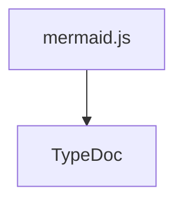

# Domain Architecture

The domain is organised around these fundamental concepts:

- {@link domain/entities/users/user | Users} represent authenticated users.

- {@link domain/entities/messages/message | Messages} refer to the messages sent by users and by the system.

- {@link domain/entities/rooms/room | Rooms} are the message rooms users may join, to which messages are sent.

- {@link domain/entities/memberships/membership | Memberships} represent the membership history of a user for a given room.

## Messages

The uniquely identifiable entity representing a message in the system is a {@link domain/entities/messages/message!SentMessage | SentMessage}. Before being sent, there are a few value objects which represent how messages are processed and dispatched:

1. An {@link domain/entities/messages/message!IncomingMessage | IncomingMessage} represents a new message received by the system. At this point it has not been processed or stored.
2. A message prefixed with a forward slash (e.g. `/help`) is considered to be a command, represented by an {@link domain/entities/commands!IncomingCommand | IncomingCommand}.
3. A newly generated message which has not yet been dispatched is a {@link domain/entities/messages/message!DraftMessage | DraftMessage}.
4. A draft message is sent to the message {@link domain/entities/messages/message!Dispatcher | Dispatcher} which will sent the message to the appropriate room and store it in the room's history as a {@link domain/entities/messages/message!SentMessage | SentMessage}.

## Commands

A message identified as an `IncomingCommand` will be parsed and (if it is a valid command) executed.

## Message pipeline

