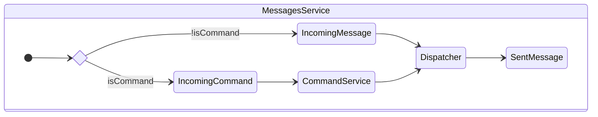
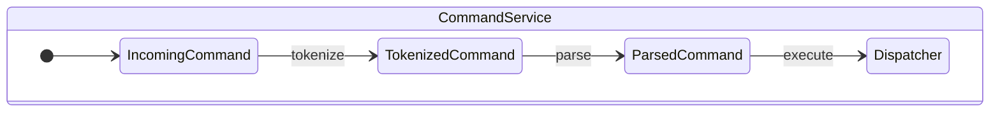

# Domain Architecture

The domain is organised around these fundamental concepts:

- {@link domain/entities/users/user | Users} represent authenticated users (or the {@link domain/entities/users/system-user | system user}).

- {@link domain/entities/messages/message | Messages} refer to the messages sent by users and by the system.

- {@link domain/entities/rooms/room | Rooms} are the message rooms users may join, to which messages are sent.

- {@link domain/entities/memberships/membership | Memberships} represent the membership status history (`PendingApproval`, `Joined`, `Revoked`, etc.) of a user for a given room. This history is used to authorize users using an {@link domain/usecases/auth-service | AuthService}.

## Messages

The uniquely identifiable _entity_ representing a message in the system is a {@link domain/entities/messages/message!SentMessage | SentMessage}. Before being sent, there are a few _value objects_ which represent how messages are processed and dispatched:

1. An {@link domain/entities/messages/message!IncomingMessage | IncomingMessage} represents a new message received by the system. At this point it has not been processed or stored.
2. A message prefixed with a forward slash (e.g. `/help`) is considered to be a command, represented by an {@link domain/entities/commands!IncomingCommand | IncomingCommand}.
3. A newly generated message which has not yet been dispatched is a {@link domain/entities/messages/message!DraftMessage | DraftMessage}.
4. A draft message is sent to the message {@link domain/entities/messages/message!Dispatcher | Dispatcher} which will sent the message to the appropriate room and store it in the room's history as a {@link domain/entities/messages/message!SentMessage | SentMessage}.

The entrypoint to the messaging pipeline is the {@link app/messages/messages-service.MessagesService | MessagesService}. A simplified view of this service looks like this:

## Commands

A message identified as an `IncomingCommand` will be parsed and (if it is a valid command) executed.

The {@link app/messages/command-service.CommandService | CommandService} applies the following steps to match parsed commands and execute them with the appropriate use case:

- The {@link domain/usecases/commands/parse/tokenize-command.tokenizeCommand | tokenizeCommand} function perfoms a lexing role, tokenizing the incoming commmand based on whitespace and returning a {@link domain/usecases/commands/parse/tokenize-command.TokenizedCommand | TokenizedCommand} which allows for easy parsing.
- The {@link domain/usecases/commands/parse/parse-command.ParseCommandUseCase | ParseCommandUseCase} class parses tokenized commands, returning a {@link domain/usecases/commands/parse/parsed-command.ParsedCommand | ParsedCommand}, a type safe discriminated union of all possible commands.
- Once the command is parsed, the `CommandService` will match the parsed command and execute the corresponding use case.
- These use cases will update entities and send messages via the `Dispatcher` as appropriate.
